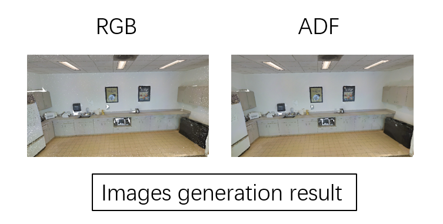

# OSTRA

**ADF** 介绍


## :computer:Getting Started
### Clone ADF
```shell
#Clone ADF
git clone --recursive https://github.com/ganlab/ADF.git
cd ADF

#Install dependencies:
pip install -r requirements.txt
```


### Example
```shell
#Images generation:
python Image_generation.py --path ./examples --resolution [1048,576] --batch 200 --k [3.2]

#Back projection:
#In the path ./examples/area_5_pantry_1/mask, we provided the two -dimensional segmentation results obtained by using image_generation.py, and saved it as a NPY file. You can choose any way to get the segmentation result.
python back_projection.py --path ./examples

#Segmentation result evaluation
python calculating_segmentation_results.py --path ./examples
```


### Result

Results of image generation and segmentation:




## :book:Citation
Please considering cite our paper if you find this work useful!
```
@misc{
}
```

## :clap: Acknowledgements
This work is based on [Open3D](https://github.com/isl-org/Open3D).